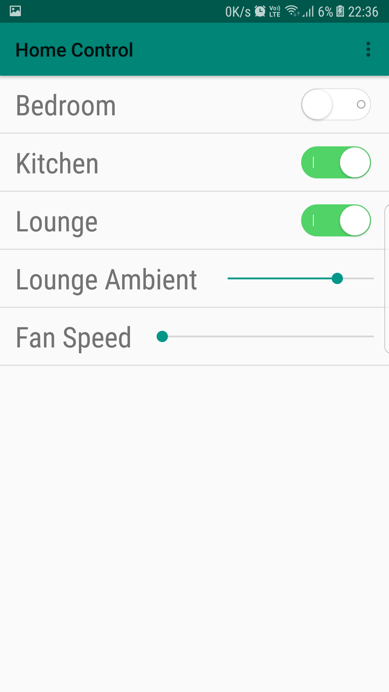
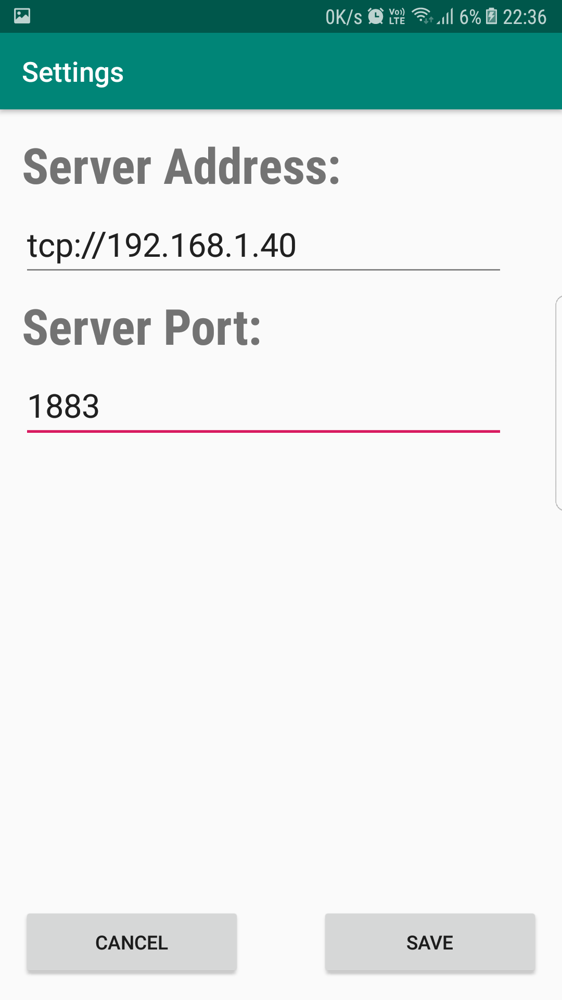
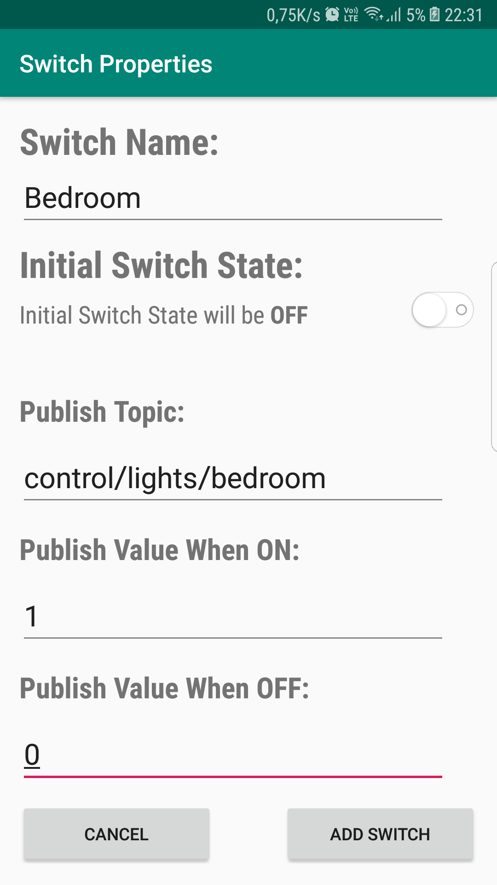
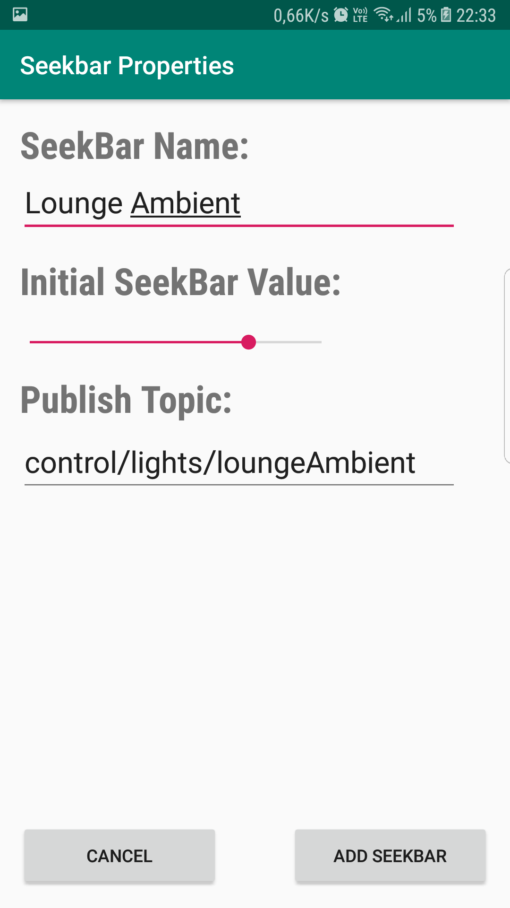

# Home Automation Android Application

This application originally developed to control ESP8266 module using MQTT Protocol. But it can be used to control any device that uses MQTT Protocol.

You can add switch and seekbar items to control switches(on/off devices) and dimmers. Currently, only these two items are added but more may be added in the future.

Feel free to fork/download and customize!

# Images
  

  

